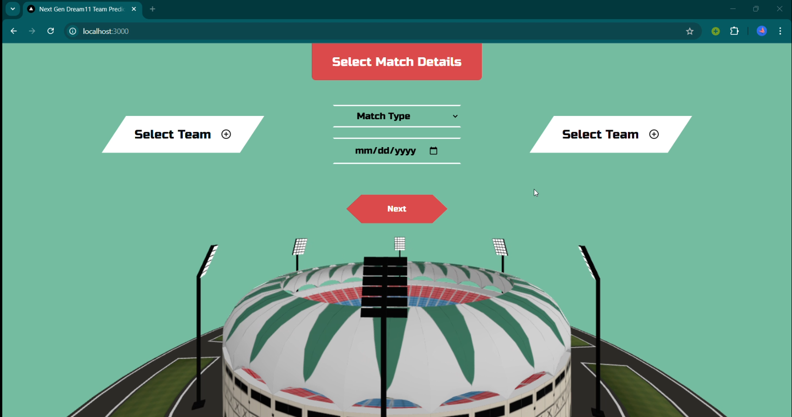
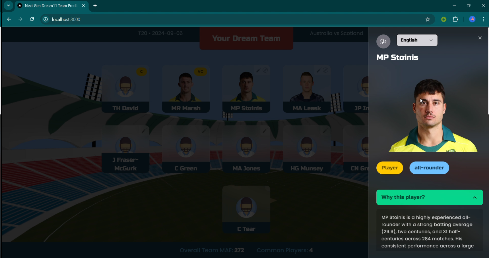

## Dream11 Team Predictor
This project aims to enhance user engagement and improve team selection efficiency on the Dream11 Fantasy Cricket platform. The solution involves:

- Predicting top-performing players for upcoming cricket matches using historical data and machine learning.
- Improving user experience with intuitive UI features like real-time analytics, detailed player reports, and multilingual audio support.

By combining predictive analytics and user-centric design, the project addresses key pain points for Dream11 users and simplifies decision-making.




# Usage
clone the repository
```bash
git clone https://github.com/HemantKumar01/Dream11-Team-Predictor.git
```
### Using the Predictor
head over to `src/UI/Product_UI` and follow instructions there to install and run the product_ui frontend and backend.

### Training The Model
First download and extract the data from [Here](https://drive.google.com/file/d/1zYoOv0FaTvS2eh3e3YGW0_u6Ty22QAee/view?usp=sharing) into the `src/data` folder

To train the model, head over to `src/UI` and run the `ModelUI.py` which contains a streamlit based ui to train the model. The trained model will be saved in `src/model_artifacts` folder with name `ModelUI_<match_type>_<train_end_date>.pth`.
If you are satisfied with the training result, rename the artifact to `Product_UI_<match_type>_Model.pth` and run the product_ui again.


#  Directory Structure

````
├── README.md                   <- Project overview and usage instructions


├── data                        <- Data folder with all stages of data
│   ├── interim                 <- Intermediate data files generated during processing
│   ├── processed               <- Finalized datasets ready for modeling
│   └── raw                     <- Original data as downloaded
│       ├── cricksheet_data     <- Raw data from Cricksheet
│       └── additional_data     <- Raw data from other sources, if any


├── data_processing             <- Scripts to process data
│   ├── data_download.py        <- Download all project data using this script. All raw data sources are processed here before further use.
│   └── feature_engineering.py  <- Handles all data manipulation and feature engineering for the project.


├── docs                        <- Documentation and project demo
│   └── video_demo              <- Walk-through video, covering setup, UI, and functionality


├── model                       <- Modeling scripts for training and prediction
│   ├── train_model.py          <- Model training script
│   └── predict_model.py        <- Prediction script with trained models


├── model_artifacts             <- Storage for trained models
│                             (Includes pre-trained model for Product UI and models from Model UI)


├── out_of_sample_data          <- Sample dummy data for evaluation matches, After submission is done we will put testing data here (4th - 14th Dec)
                                in the same format as the sample data provided. This folder should be well integrated with Model UI where it will
                                automatically append the new data with already avalaible data from cricksheet.


├── rest                        <- For any miscellaneous requirements not covered by other folders 

└── UI                          <- All files related to the user interface 
````


